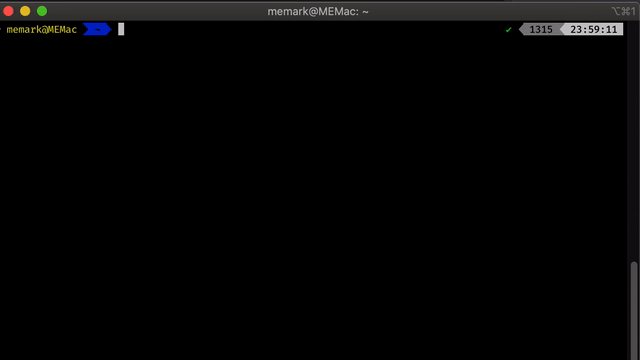

# zsh-dotnet-completion

> Zsh plugin for _dotnet_ CLI completion



This is basically just a wrapper for the instructions found at [How to enable TAB completion for the .NET Core CLI](https://docs.microsoft.com/en-us/dotnet/core/tools/enable-tab-autocomplete#zsh) by Microsoft.

The structure of this repo was inspired by [zsh-better-npm-completion](https://github.com/lukechilds/zsh-better-npm-completion) by Luke Childs, from which I also copied all the installation instructions.

## Installation

### Using [Antigen](https://github.com/zsh-users/antigen)

Bundle `zsh-dotnet-completion` in your `.zshrc`

```shell
antigen bundle memark/zsh-dotnet-completion
```

### Using [zplug](https://github.com/b4b4r07/zplug)

Load `zsh-dotnet-completion` as a plugin in your `.zshrc`

```shell
zplug "memark/zsh-dotnet-completion", defer:2
```

### Using [zgen](https://github.com/tarjoilija/zgen)

Include the load command in your `.zshrc`

```shell
zgen load memark/zsh-dotnet-completion
```

### As an [Oh My ZSH!](https://github.com/robbyrussell/oh-my-zsh) custom plugin

Clone `zsh-dotnet-completion` into your custom plugins repo

```shell
git clone https://github.com/memark/zsh-dotnet-completion ~/.oh-my-zsh/custom/plugins/zsh-dotnet-completion
```

Then load as a plugin in your `.zshrc`

```shell
plugins+=(zsh-dotnet-completion)
```

### Manually

Clone this repository somewhere (`~/.zsh-dotnet-completion` for example)

```shell
git clone https://github.com/memark/zsh-dotnet-completion.git ~/.zsh-dotnet-completion
```

Then source it in your `.zshrc`

```shell
source ~/.zsh-dotnet-completion/zsh-dotnet-completion.plugin.zsh
```

## License

MIT © Magnus Markling
